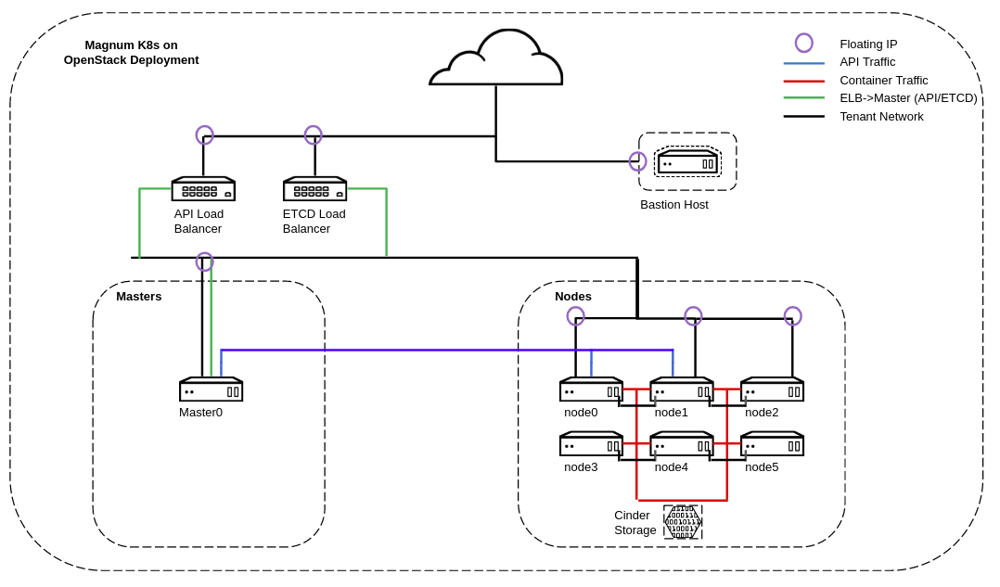
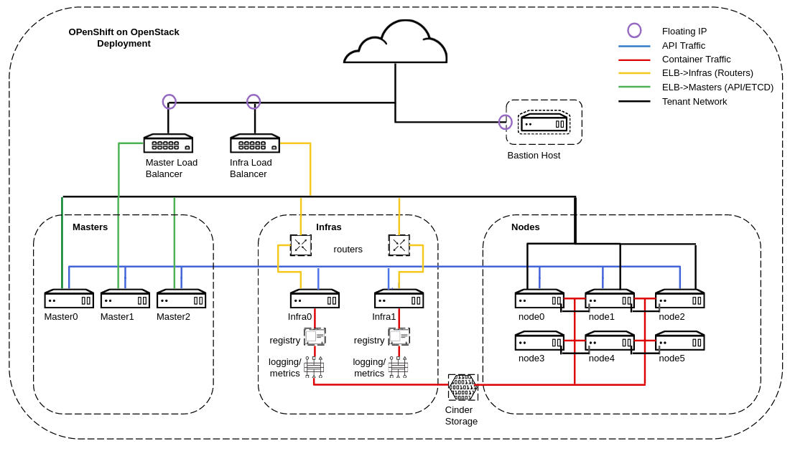

# OpenShift vs K8s on OpenStack: It's a PaaS

The purpose of this repository is to provide a workshop and exercises for exploring the various PaaS infrastructure, available on OpenStack. The two obvious choices are Magnum and OpenShift. This workshop, through exercises will provide an overview of both. Upon completing the workshop, attendees should have a solid understanding for what it means to operate a PaaS on OpenStack, understand why Magnum or OpenShift might be interesting and hand-on experience with both. Attendees should walk away with the right knowledge to decide on the best PaaS for their requirements.

The environment is OpenStack Queens based on the community RDO distribution. The cloud is running on a Hetzner root server (12 cores, 128GB RAM, SSDs). The guide for build this cloud is provided here: [https://keithtenzer.com/2018/07/17/openstack-13-queens-lab-installation-and-configuration-guide-for-hetzner-root-servers/](https://keithtenzer.com/2018/07/17/openstack-13-queens-lab-installation-and-configuration-guide-for-hetzner-root-servers/).

The PaaS is built around Magnum or OpenShift. One OpenStack Cloud runs K8s via Magnum and the other OpenShift. Certainly a single cloud could run both, we have separated them due to resource limits of the hardware. 

## PaaS Terminology
Pod: IP space and abstraction layer around container. Usually you will see 1:1 relationship between pod and container but in case of tightly coupled services, multiple containers in a pod may be desired.

Side-car Container: Additional containers running in pod that provide certain capabilities that need to be coupled.

Router: Basically it is an ha-proxy. Traffic needs to get from external network (floating ip) to the internal services in K8s. There are various ways to do this, routing refers to proxy of external URLs to K8s services.

Registry: Datastore for container images. Images are cached on nodes but they need to be pulled from a source which is your registry. Most will not want to use dockerhub and will likely have a local registry.

## Magnum 
Provides an abstraction around PaaS technologies: Docker, Mesosphere and K8s. Of course I think it is safe to say really only K8s matters so that is what we will focus on. Magnum will deploy a vanilla K8s environment. It can deploy K8s masters, which run control plane (API, Scheduler, ETCD) and K8s nodes which run applications. The deployment consits of 1 master (API, ETCD, Scheduler) and K8s nodes which run applications. Magnum also congiured a load balancer for API and ETCD traffic.

Below is architecture for the Magnum K8s environment.


## OpenShift
Provides a real platform, not just K8s. OpenShift of course provides a distribution of K8s but it provides a lot around it out-of-the-box. OpenShift has a community distribution called OKD, similar to RDO for OpenStack and this is what we are using. In addition an enterprise version exists from Red Hat. Some things that OpenSHift provides in addition to K8s are: SDN, Security, Metrics, Monitoring, Logging, CI/CD, xPaaS (application services, container images), routing (proxy external traffic to K8s service), ISTIO (service mesh), Operators (stateful-sets, programatic services) and more. The deployment consists of 3 masters (API/ETCD/Scheduler), 2 Infras (Routers, Monitoring, Metrics, Logging) and 6 nodes for applications. Magnum and K8s doesn't provide routing layer or out-of-box metrics, monitoring, logging so there is no concept of infra nodes. This is something you would have to build on your own. 

OpenShift has been deployed using ansible and heat. You can get more information and the playbooks here: [https://github.com/ktenzer/openshift-on-openstack-123](https://github.com/ktenzer/openshift-on-openstack-123).

Below is architecture for the OpenShift environment.


## Basic Exercises
There are three main exercises. Each exercise is the same for both K8s and OpenSHift. The idea is to give a feeling for the differences and learn more about PaaS. 

* Exercise 1: Setup Remote CLI and Student Environment
* Exercise 2: Deploy Hello World App
* Exercise 3: RBAC and Service Accounts

It is reommended to run each exercise on both K8s and OpenShift before moving to next exercise.

## Day 2 Operations Exercises
These exercises should provide students more insight into operating a PaaS platform and what is involved after your apps are up and running.

* Exercise 4: Application Health Checks
* Exercise 5: Application Deployment Strategies
* Exercise 6: Monitoring, Metrics and Logging

## Magnum Issues
* Magnum Queens only works with one master
* Bug in config file, missing docker volume type.
```
$ vi /etc/magnum/magnum.conf
[cinder]
default_docker_volume_type = iscsi
```
* Only fedora atomic images work, not coreos. Make sure you tag image properly.
```
$ openstack image create --disk-format qcow2 --container-format bare --public --property os_distro='fedora-atomic' --file fedora-atomic-latest.qcow2 "fedora-atomic-latest"
```
* Integration with OpenStack is minimal, basically just load balancer. No keystone or Cinder. You need to configure this manually.
* Cinder does not work in Rocky. K8s until 1.14 only supports cinder v2 and this appears to be depricated in rocky.
* Only TLS works, not sure why you would want to do unsecure but it isn't working.
