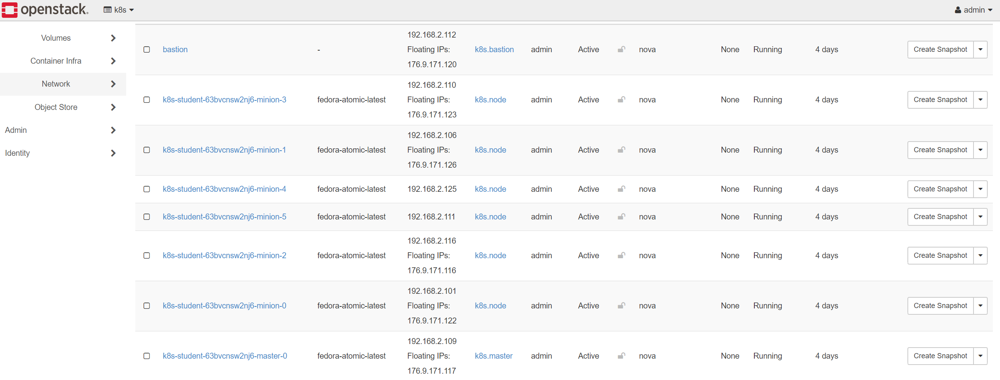

# Exercise 2: Create Hello World Application and Service
Note: For this demo we will use Paul Bouwer's hello world app.

## Create Service and Deployment Config

```
$ vi kubernetes-hello.yaml
apiVersion: v1
kind: Service
metadata:
  name: hello-kubernetes
spec:
  type: NodePort
  ports:
  - port: 80
    targetPort: 8080
  selector:
    app: hello-kubernetes
---
apiVersion: apps/v1
kind: Deployment
metadata:
  name: hello-kubernetes
spec:
  replicas: 1
  selector:
    matchLabels:
      app: hello-kubernetes
  template:
    metadata:
      labels:
        app: hello-kubernetes
    spec:
      containers:
      - name: hello-kubernetes
        image: paulbouwer/hello-kubernetes:1.5
        ports:
        - containerPort: 8080
        env:
        - name: MESSAGE
          value: Hello World on Kubernetes!
```

## Deploy App and Service
```
$ kubectl create -f kubernetes-hello.yaml
```

## Find Node running application
```
$ kubectl get pods -o wide
NAME                                READY     STATUS    RESTARTS   AGE       IP            NODE
hello-kubernetes-7fc5bf6466-kkp22   1/1       Running   0          9s        10.100.76.3   k8s-test-cjw5kd63mfyl-minion-0
```

## Find the floating IP of the node
Students don't have access to OpenStack project where k8s is running. Below is a screenshot of the nodes. Simply identify the node name from above command to get it's floating ip.




## Find port exposed externally on Node
```
$ kubectl get service
NAME TYPE CLUSTER-IP EXTERNAL-IP PORT(S) AGE
hello-kubernetes NodePort 10.254.242.123 <none> 80:31188/TCP 6m
```

## Connect to application using Node Floating IP and Port


http://<floating ip>:31188


