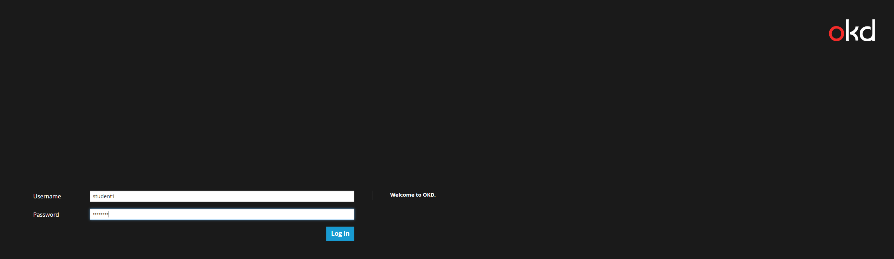
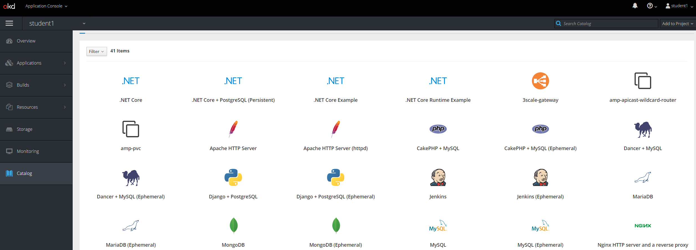

# Exercise 1: Setup OpenShift Client

Make sure you change the <#> to your student number.

## Login to OpenShift Cluster
This will automatically generate a token. Tokens expire after 24 hours. once token expires you will be prompted for username and password.

```
$ oc login https://openshift.5.9.163.229.xip.io:8443 --insecure-skip-tls-verify=true
```

## Create OpenShift Project
By default users can create projects, this can be disabled. A project is a namespace but in OpenShift it is also so much more.

```
$ oc new-project student<#>
```

## Login in to UI and explore project
You can also create new projects in the UI.

https://openshift.5.9.163.229.xip.io:8443




After logging in you will see the service catalog and a list of projects on the right. You should see your student project.

