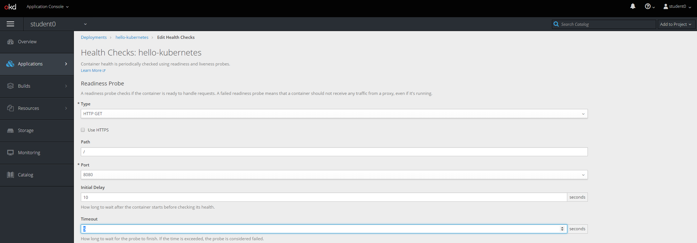
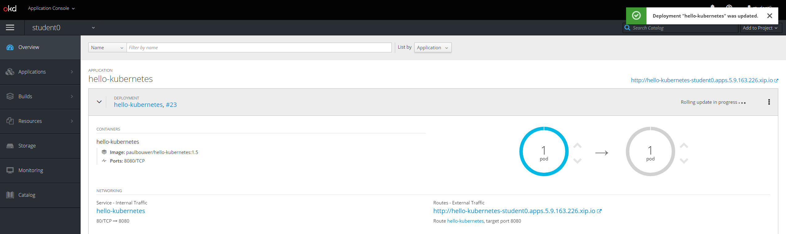
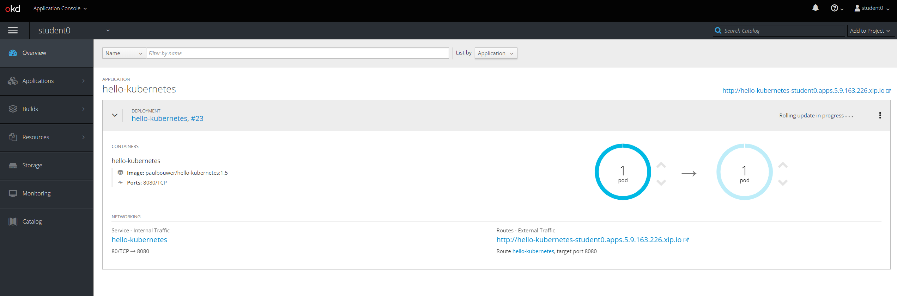

# Exercise 4: Application Health Checks
OpenShift allows for two types of health probes: readiness and liveness. The readiness probe is used before the application is started. If the probe is successful the pod will be available to the service. Until the readiness probe is successful a pod won't be put into service. In the GUI the readiness probe is a light blue circle around pod. Once the readiness probe completes successfully, the pod is placed into service and will recieve traffic. This is shown as dark blue circle around pod in the UI. The liveness probe is run with regularity to ensure the pod continues to operate as expected.

OpenShift allows a probe to be defined by an http get, tcp socket or a command run in container. Typically you would want to provide an API /health endpoint and then if it is healthy a 200 returns. Sometimes though if you have a database you may need to actually run a command in the container to ensure it is healthy or even check tcp socket for non-http applications.

## Define Rediness Probe and Liveness Probe
Open a browser and connect to OpenShift. Go into your student project. Under application->deployment select the hello-kubernetes deployment. On the right under actions dropdown select 'Edit Helath Checks'.


Next select 'Add readiness probe'


Since our application uses http we will use a simple http get probe to test the application. Ensure the port is the destination port that the application is listening on within container, not the service. Set a delay of 30 seconds. In this case we are just using delay so we can see the readiness probe running. It will wait the delay time before doing probe. Set timeout to 5 seconds.



Next define a liveness probe. You can use same settings. Select save and then immediately go back to overview to see deployment happen live.


OpenShift performs a rolling update. The old pod is still running (dark blue) while the new pod image is pulled. You will notice the new pod have a light circle for 30 seconds, this is due to delay of the readiness probe. Once readiness probe completes, the cutover is made to the new pod and it now has a dark blue circle while the old pod is simply deleted.





## View Health Probes in Deployment
You can of course add probes via CLI, they are simply a configuration of the deployment. Using the oc command view the deployment and you will now see the readiness and liveness probes.

```
$ oc get deployment hello-kubernetes -n student0 -o yaml
apiVersion: extensions/v1beta1
kind: Deployment
metadata:
  annotations:
    deployment.kubernetes.io/revision: "23"
  creationTimestamp: 2018-11-03T10:59:32Z
  generation: 23
  labels:
    app: hello-kubernetes
  name: hello-kubernetes
  namespace: student0
  resourceVersion: "836358"
  selfLink: /apis/extensions/v1beta1/namespaces/student0/deployments/hello-kubernetes
  uid: 8b0f63d2-df57-11e8-8181-fa163eed49fb
spec:
  progressDeadlineSeconds: 600
  replicas: 1
  revisionHistoryLimit: 10
  selector:
    matchLabels:
      app: hello-kubernetes
  strategy:
    rollingUpdate:
      maxSurge: 25%
      maxUnavailable: 25%
    type: RollingUpdate
  template:
    metadata:
      creationTimestamp: null
      labels:
        app: hello-kubernetes
    spec:
      containers:
      - env:
        - name: MESSAGE
          value: Welcome to Berlin
        image: paulbouwer/hello-kubernetes:1.5
        imagePullPolicy: IfNotPresent
        livenessProbe:
          failureThreshold: 3
          httpGet:
            path: /
            port: 8080
            scheme: HTTP
          initialDelaySeconds: 10
          periodSeconds: 10
          successThreshold: 1
          timeoutSeconds: 5
        name: hello-kubernetes
        ports:
        - containerPort: 8080
          protocol: TCP
        readinessProbe:
          failureThreshold: 3
          httpGet:
            path: /
            port: 8080
            scheme: HTTP
          initialDelaySeconds: 30
          periodSeconds: 10
          successThreshold: 1
          timeoutSeconds: 5
        resources:
          limits:
            cpu: "1"
            memory: 100Mi
          requests:
            cpu: 50m
            memory: 50Mi
        terminationMessagePath: /dev/termination-log
        terminationMessagePolicy: File
      dnsPolicy: ClusterFirst
      restartPolicy: Always
      schedulerName: default-scheduler
      securityContext: {}
      terminationGracePeriodSeconds: 30
status:
  availableReplicas: 1
  conditions:
  - lastTransitionTime: 2018-11-03T18:28:29Z
    lastUpdateTime: 2018-11-03T18:28:29Z
    message: Deployment has minimum availability.
    reason: MinimumReplicasAvailable
    status: "True"
    type: Available
  - lastTransitionTime: 2018-11-03T10:59:33Z
    lastUpdateTime: 2018-11-05T11:40:54Z
    message: ReplicaSet "hello-kubernetes-966d4c6f6" has successfully progressed.
    reason: NewReplicaSetAvailable
    status: "True"
    type: Progressing
  observedGeneration: 23
  readyReplicas: 1
  replicas: 1
  updatedReplicas: 1
```
