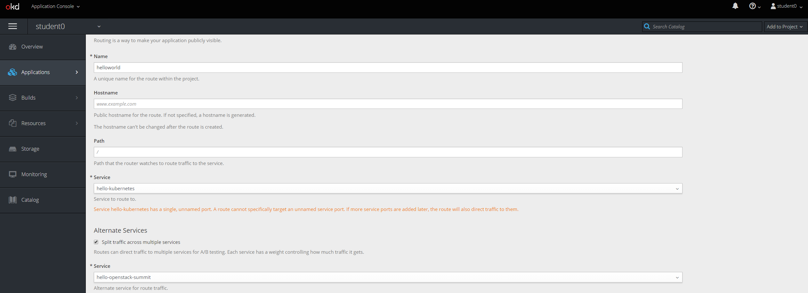
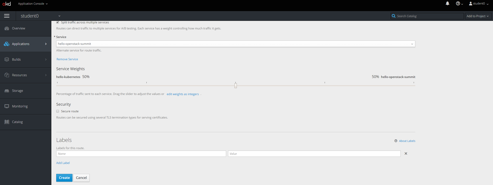
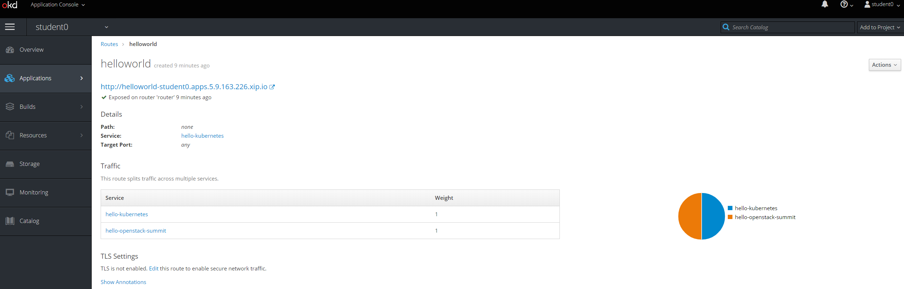
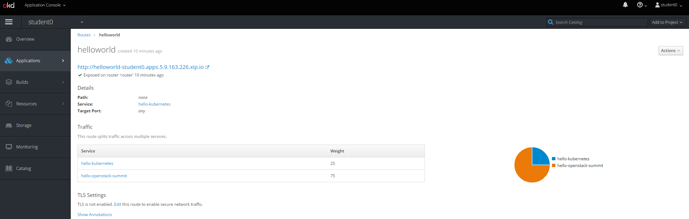

# Exercise 5: Application Deployment Strategies

OpenShfit support a variety of application deployments strategies: rolling, recreate, custom, blue/green or A/B and canary. The strategy defines how the pods are upgraded. The default is a rolling strategy which means updates will be done in rolling fashion, pod by pod or a percentage of pods at a time. Of course the readiness probes play a very important role and also the OpenShift service which will place new pods in service once they pass readiness probe. For deployments such as canary or blue/green two versions of application exist and a OpenShift route is used to balance traffic to perform either an instance cutover to new version of application (blue/green) or even have both version in service at same time (canary).

## Deploy a new openstack-summit-hello application
This is basically the same app we deployed in exercise 2 just with three replicas, the readiness/liveness probes, different labels and a different greeting.

```
$ vi openstack-summit-hello.yaml
apiVersion: v1
kind: Service
metadata:
  name: hello-openstack-summit
spec:
  type: ClusterIP
  ports:
  - port: 80
    targetPort: 8080
  selector:
    app: hello-openstack-summit
---
apiVersion: apps/v1
kind: Deployment
metadata:
  name: hello-openstack-summit
spec:
  replicas: 3
  selector:
    matchLabels:
      app: hello-openstack-summit
  template:
    metadata:
      labels:
        app: hello-openstack-summit
    spec:
      containers:
      - name: hello-kubernetes
        image: paulbouwer/hello-kubernetes:1.5
        ports:
        - containerPort: 8080
        env:
        - name: MESSAGE
          value: Hello World on OpenStack!
          livenessProbe:
            failureThreshold: 3
            httpGet:
              path: /
              port: 8080
              scheme: HTTP
            initialDelaySeconds: 30
            periodSeconds: 10
            successThreshold: 1
            timeoutSeconds: 5
          readinessProbe:
            failureThreshold: 3
            httpGet:
              path: /
              port: 8080
              scheme: HTTP
            initialDelaySeconds: 30
            periodSeconds: 10
            successThreshold: 1
            timeoutSeconds: 5
```

Deploy App and Service
```
$ oc create -f openstack-summit-hello.yaml
```

Expose service
```
$ oc expose service hello-openstack-summit
```

## Create new route to serve as external endpoint

As we have seen so far a route is used to provide external access to a service. We have exposed both our services but those routes only service a single service. A route can also be created that can balance across service. This is exactly what is required for blue/green or canary deployments. We will now create a route that balances traffic across both services, the hello-kubernetes and hello-openstack-summit.

Open browser and go to your OpenShift project. Under applications->routes, create a new route. Set the name to helloworld and split traffic. You should see both services in route and traffic balance should be 50% or split.






## View traffic balancing

Do to browser caching, unless you remove cache you won't see balance as browser caches on client side. However you can use curl which obviously doesn't cache.

```
$ for p in {1..1000}; do curl http://helloworld-student<#>.apps.5.9.163.226.xip.io/; sleep 1; done
```

Make sure you use your URL. You should observe that every two requests the service is switched. 

## Change Traffic Balancing

In browser go into the route. You will see a 50/50 traffic split.


Next change balancing to be 75% openstack and 25% kubernetes.


Finally go back to curl that is running. You should now see 3 requests going to openstack and 1 to kubernetes 75/25 traffic split.

What we have observed is more of a canary deployment, blue/green or A/B would mean simply doing cutover to new version after it is updated and tested.


